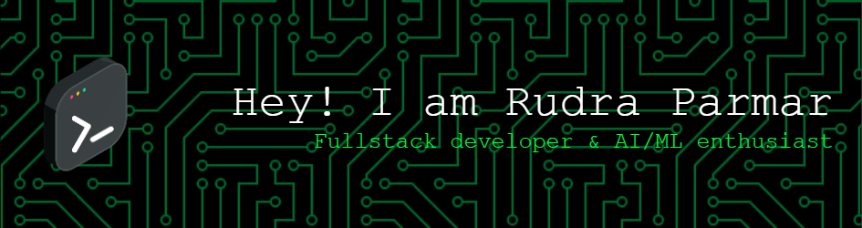

<h1 align="center">
  
</a>
</h1>

## 🌐 Socials:

 
  
  
  <a href="https://rudraa-portfolio.vercel.app/" target="_blank">
      <!-- sqlite, safari, google-chrome are other good icon options -->
  </a>

## 💻 Tech Stack:

  

## 🕹️ Pac-Man eating my contributions

## ⚡ Stats:

  
  
   
  

## 🏆 GitHub Trophies

### 🔝 Top Contributed Repo

## ✨ Badges

  

---
<h1 align="center">

</h1>
